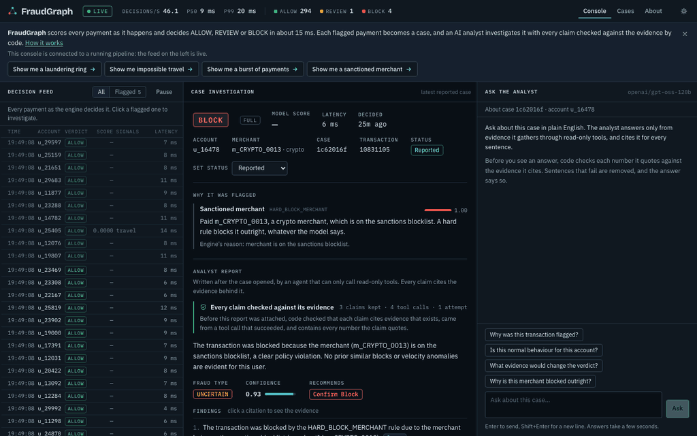
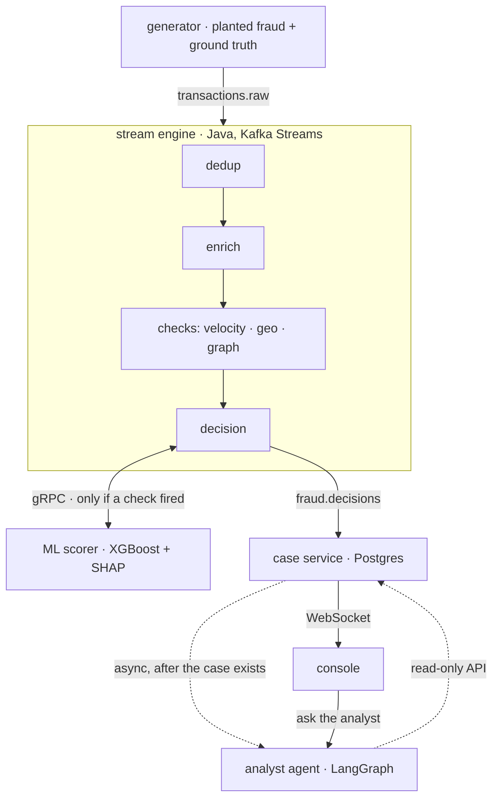

# FraudGraph

[](https://github.com/heyush79/fraudgraph/actions/workflows/ci.yml)

**Real-time payment fraud detection with an AI analyst that cannot make things up.** Every
payment gets a verdict (ALLOW, REVIEW or BLOCK) in milliseconds from a Kafka Streams engine,
an XGBoost model scores the suspicious ones, and a language model investigates every flagged
case in writing, with each sentence checked by code against the evidence it cites.

**[▶ Open the console](https://heyush79.github.io/fraudgraph/)** · [Design and tradeoffs](docs/DESIGN.md) · [How ring recall went from 7% to 84.5%](docs/blog/ring-recall.md) · [Low-level design](docs/fraudgraph-lld.md)



## In 30 seconds

- **Streaming decisions.** Java 17 and Kafka Streams: dedup, enrichment, velocity windows,
  impossible-travel checks and an in-memory transaction graph that finds laundering rings.
  Decision latency p50 8 ms, p99 22 ms.
- **ML with a fail-safe.** XGBoost with TreeSHAP explanations behind gRPC, a 150 ms deadline
  and a circuit breaker. Scorer down? Decisions keep flowing on rules alone, marked DEGRADED,
  and never auto-block.
- **An analyst agent held to its evidence.** LangGraph investigates each case through
  read-only tools, and a verifier written in plain Python removes any claim whose numbers are
  not in the evidence it cites. Ask it questions in the console; you can see which claims it
  was not allowed to make.
- **Measured against ground truth.** The generator knows what fraud it planted, so recall is
  measured on what production actually caught, not on a held-out table. That measurement is how
  the weakest number in the project was found and fixed:
  [ring recall was 44% offline, 7% live, and is now 84.5%](docs/blog/ring-recall.md).

## Architecture



The language model is never on the decision path: it runs after a case exists, reads only
through the case service's read API, and its report is checked by code before it is stored.
The reasoning behind each choice, and what it cost, is in [DESIGN.md](docs/DESIGN.md).

## Numbers

| | |
|---|---|
| decision latency, payment timestamp to verdict (223k decisions) | p50 8 ms · p95 14 ms · p99 22 ms |
| scorer round trip (gRPC) | p50 6 ms · p99 11 ms |
| worst latency with the scorer down | 41 ms, rules only |
| model v3 (time-split test set) | PR-AUC 0.874 · 0.803 without the new features |
| production ring recall: before · new gate · new gate + model v3 | 7.2% · 71.9% · **84.5%** |
| automatic blocks that were real fraud (production, v3) | 98.7% |
| legitimate payments flagged, excluding policy blocks: before · after | 0.038% · 0.085% |
| analyst agent, right call (17 cases, free-tier model) | planted fraud 9/9 · policy breach 7/7 |

## Run it

Needs Docker; the tests also need JDK 17, Maven and Python 3.11+ with [uv](https://github.com/astral-sh/uv).

```bash
make demo              # everything: kafka, engine, scorer, case service, agent, console, traffic
open http://localhost:3000
make scenario-ring     # plant a 5-account laundering ring now and watch it get caught
make recall            # what the running system caught, per fraud pattern
make train             # retrain the scorer on the engine's own feature log and hot-reload it
make share             # a temporary public HTTPS link to your running stack
make test              # every unit test: JUnit and pytest, no broker and no API key needed
```

The analyst needs a free [Groq](https://console.groq.com) key in `.env` as `GROQ_API_KEY`;
without one, everything else works and the console says the analyst is offline. The scorer
serves the model that ships in `ml-scorer/registry/` (v3) from the first minute; `make train`
retrains it on your own traffic. [deploy/](deploy/README.md) runs the whole stack permanently
on a free cloud VM.

## What is in the repository

| | |
|---|---|
| [`stream-engine/`](stream-engine) | Java 17, Spring Boot, Kafka Streams Processor API: the checks, the graph, the decision |
| [`ml-scorer/`](ml-scorer) | Python gRPC scorer, training from the decision log, threshold sweep, production recall |
| [`case-service/`](case-service) | Java, Spring Boot, Postgres: cases, the WebSocket feed, the agent's read API |
| [`analyst-agent/`](analyst-agent) | Python, LangGraph: investigations, the verifier, the ask endpoint, evals |
| [`dashboard/`](dashboard) | React console; replays a recorded session when there is no backend |
| [`generator/`](generator) | synthetic traffic with planted fraud and ground-truth labels; on-demand scenarios |
| [`showcase/`](showcase) | records a real session for the public replay |
| [`proto/scoring.proto`](proto/scoring.proto) | the feature vector, the single definition both languages generate from |

## Limitations

One broker and one engine instance; the transaction graph lives per instance and is not
persisted; production recall is bounded by the rules that decide when the model is consulted;
the first transfer of a ring cannot be told from an ordinary one; the verifier checks that
quoted numbers exist in the cited evidence, not what the sentence says about them. Each is
explained, with its fix, in [DESIGN.md](docs/DESIGN.md#what-is-not-done) and
[LLD §11](docs/fraudgraph-lld.md). How it was built, phase by phase:
[BUILD_HISTORY.md](docs/BUILD_HISTORY.md).
