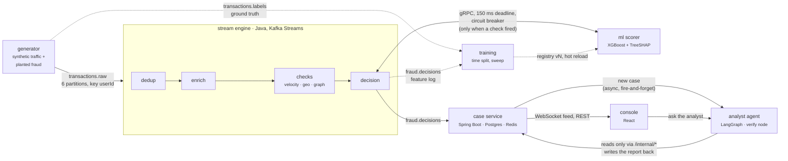

# FraudGraph: design and tradeoffs

FraudGraph decides whether each payment in a stream should be allowed, reviewed or blocked,
in milliseconds, and then has a language model write an investigation of every flagged case
in which each sentence is checked, by code, against the evidence it cites. This document
explains the decisions behind it and what each one cost. The low-level specification (topics,
stores, schemas, config) is [`fraudgraph-lld.md`](fraudgraph-lld.md); this is the argument
for it.

The constraints that shaped everything:

- **A verdict per transaction in well under a second**, from a stream, one transaction at a
  time. Batch scoring is not an option for a payment that is waiting.
- **Every verdict explainable**: which rule fired, which features pushed the model, and a
  written investigation for anything flagged.
- **The language model never on the decision path.** Models are slow, variable and
  occasionally wrong; a payment verdict can be none of those.
- **One machine, zero cost.** Everything runs in Docker on a laptop, the model runs on a free
  API tier, and the public demo is free to host.

## The system

Solid lines are the hot path or the product; dotted lines are offline. The agent is reached
only after a case exists, and only reads through the case service.

## Decisions

Each entry is the choice, what it was chosen over, and what it cost.

### Hot-path state lives in Kafka Streams, not Redis

Velocity windows, amount profiles, last known locations and the dedup set are RocksDB state
stores inside the engine, each backed by a compacted changelog topic. **Over** a shared Redis:
a network round trip per read on the hot path, and a second system whose state can disagree
with the stream's. Local state is read in microseconds, is partitioned exactly like the input
(by user), and is restored from its changelog after a crash, so exactly-once processing covers
it too. **Cost:** state is only queryable through the engine (it exposes a small read API for
the case service), and scaling out means rebalancing state with the partitions. Redis is
still used, for what it is good at: a per-user list of recent decisions that other services
read.

### Processor API, not the Streams DSL

The four stages (dedup → enrich → check → decision) are hand-written processors. **Over** the
DSL: the checks need to read several stores, write some of them after deciding, and call an
external scorer with its own failure handling, which in the DSL becomes a chain of joins and
`transformValues` that hides the order of reads and writes. **Cost:** more code, and
repartitioning and store wiring are explicit rather than inferred.

### Exactly-once and a dedup store

`processing.guarantee=exactly_once_v2` makes each input produce its outputs and state changes
exactly once, even when the engine crashes mid-transaction. It does not stop the same payment
arriving twice from upstream (a producer retry, a replayed file), so a `txnId` dedup store
with a TTL drops repeats before any state is touched. Case creation downstream is idempotent
again (`UNIQUE(txn_id)` and `ON CONFLICT DO NOTHING`). **Cost:** transactional producers add
latency to every commit, a fair price for a payment system.

### Event time, and windows built from buckets

Windows, TTLs and velocity counts use the payment's own timestamp, so replaying a day of
traffic reproduces the day's decisions; this was tested involuntarily when a sleeping laptop
made the generator backfill an hour, and the checks stayed correct. A sliding count cannot be
one running total (nothing tells you when an event leaves), so each window is 60 fixed buckets:
bounded memory, one read of at most 61 buckets, a count that is exact to one bucket. Amount
profiles use Welford's online algorithm, a mean and variance in constant space, with a z-score
only after 10 samples and a non-trivial spread.

### An in-memory transaction graph, not Neo4j

Peer-to-peer transfers form a graph held in the engine: adjacency lists capped at 50 recent
edges per account with a 24-hour expiry, union-find for component size, and a depth-bounded
search (≤ 5 hops) that asks, when A pays B, whether B's money can already reach A. **Over** a
graph database: a network hop on every transfer for a graph that fits in memory is the wrong
trade at this scale. **Cost:** the graph is per engine instance and is not persisted. A ring
whose transfers land on different instances is invisible, and a restart forgets the graph
until traffic rebuilds it. Both are written down as limits, with the fix (co-partitioning
transfers, or an external graph store) for when the graph outgrows one heap.

### The model is consulted only when a rule fires, and that bounds what it can catch

The engine calls the scorer when a check has fired, plus a 1% random sample. Clean traffic,
the overwhelming majority, never pays the round trip. **The cost was invisible until it was
measured.** Offline, the model caught 44% of ring transfers. In production, measured by
joining the engine's verdicts to the generator's ground truth, it caught 7.2%: a ring is only
a ring once it closes, so only the closing transfer fired a rule, and the others were never
shown to the model at all.

| ring transfer | share flagged (model v2, 94 complete rings) |
|---|---|
| first | 0% |
| middle | 0.7% |
| closing | 39.4% |

The same bound shows for the other patterns: across velocity, geo and ring, recall and "the
model was consulted" are within a point of each other. The gate, not the model, decides what
production catches. The fix for rings was a better gate rather than removing it: a
**pass-through** check notices when an account forwards money that arrived shortly before at a
similar amount (a mule keeps a cut), fires on the second transfer of a ring rather than the
last, and gives the model three new features (how much was forwarded, how soon, and how many
accounts in a row have done it). The first transfer of a ring still looks like any other
payment until someone forwards it; that is a structural limit, not a tuning problem.

**Result**, measured the same way over the same length of window, with the model unchanged:
ring recall 7.2% → 71.9% (middle transfers 0.7% → 85.9%, closing 39.4% → 95.2%). The cost is
also measured: PASS_THROUGH fires on 1.57% of honest transfers, and legitimate payments flagged
rose from 0.038% to 0.082% of traffic, because the old model has never seen the new features.
The model trained on them (v3), against the same model trained without them on the same rows
and time split: PR-AUC 0.803 → 0.874; at the review threshold the same ring recall (78%) with
63% fewer honest payments flagged; at the block threshold twice the ring recall (26% → 55%).
The features buy confidence rather than coverage, and `chain_depth` became the model's second
most important feature. In production, v3 behind the new gate: ring recall **84.5%** (every
transfer after the first: middle 99.7%, closing 100%), with most ring transfers blocked outright
instead of queued. The offline false-positive gain did not carry over: among honest transfers
that trip the pass-through check, the share flagged stayed at ~46%, because the model only sees
gated rows and an honest forward looks like a mule's. Automatic blocks stayed above the 98%
precision bar (98.7%), and legitimate payments flagged settled at 0.085% of traffic.

Scoring every transaction would remove the gate entirely, at one gRPC call per payment. It is
a legitimate design and is left as an open decision rather than slipped in as a side effect.

### A scorer behind a deadline, a breaker and a fail-safe

The scorer is called over gRPC with a 150 ms deadline, inside a Resilience4j circuit breaker
that opens after half of the last 50 calls fail (and no sooner than 10 calls in). With the
breaker open, decisions are made on rules alone and marked `mode: DEGRADED`, and the policy
refuses to auto-block on rules alone: a signal becomes REVIEW, never BLOCK, unless a hard
policy rule (a sanctioned merchant) fired. Measured: the breaker opened 37 s after the scorer
was killed, the worst end-to-end latency while it was down was 41 ms, and it closed 23 s after
the scorer came back. **The stream never waits for the model.**

### Train on what the engine saw

The engine logs the exact feature vector it built for every decision, and training reads that
log joined to the ground truth. **Over** recomputing features from raw transactions in Python:
that would be a second implementation of the engine, and training/serving skew is the most
common way real ML systems fail quietly. Here the vectors are identical by construction, the
proto is the single definition of the vector on both sides, and a parity test (which must never
be deleted) asserts it. The split is by time, never random: the last 20% of the window is the
test set, because a random split lets the model learn from the future. Thresholds are read off
a precision/recall sweep, so the config's `block: 0.99` is a row in a table (model v2's: 98.5%
precision, 57% recall), not a guess.

Models are served by feature name: when the proto grew three features, the existing model
kept scoring on the twelve it knew while the next one trained, instead of every model becoming
unservable at once.

### Honest data first

The first model looked excellent: PR-AUC 0.973 and 99% ring recall. It ranked the graph
feature last of twelve, and that was the clue. The ring injector moved ₹20,000–80,000 per hop
while honest transfers were a few hundred rupees, so the model had learned "large transfer",
not "ring". Once ring amounts came from each account's own spending, PR-AUC fell to 0.873 and
ring recall to 44%, and the cycle feature rose to ninth. A worse number from honest data is the
more useful number.

### The case service is boring on purpose

Spring Boot, Postgres, Flyway migrations that are never edited once applied, idempotent case
creation, and a WebSocket feed that batches decisions every ~200 ms and drops the oldest ALLOW
rows first under load, because losing an ALLOW row costs nothing and losing a BLOCK row costs
the demo. The hand-off to the agent is fire-and-forget behind a bounded retry queue: a slow or
absent agent can never slow down case creation.

### The agent cannot do anything but read, and cannot say anything it cannot cite

The analyst agent is a LangGraph state machine: deterministic triage from the fired rules, an
investigation loop with a hard budget of tool calls, a report in a fixed schema where every
finding lists the evidence it rests on, and a `verify` node that is plain code. It checks that
every citation exists, points at a tool call that succeeded, and that every number the claim
quotes appears in the evidence it cites. A failure gets one retry with the specific problems;
a second failure publishes the case as UNCERTAIN with the unsupported claims removed.

Its four tools are HTTP calls to the case service's read-only `/internal` API. It has no
database handle, no Kafka client and no access to the engine's state. That boundary, rather
than any instruction in a prompt, is what stops a model doing something unexpected.

**The guard had holes, and they were found by using it.** Building the chat panel showed that
"small numbers are exempt" had been implemented as "all numbers below three are exempt", which
included model scores: a fabricated "the model scored it 0.42" passed. The number of keys in a
JSON object counted as evidence, so "flagged 12 times" passed against a document with twelve
fields. Both are fixed and tested; re-running the tightened check over every finding stored so
far rejected none of them. What the check still cannot do is judge meaning: a number that exists
in the cited evidence passes whatever the sentence says it is. Structured claims, where the
model fills `{field, value, ref}` and prose is generated from them, would close that.

Measured on the free tier (17 cases, gpt-oss-120b): the right call on 9 of 9 planted frauds and
7 of 7 policy breaches, and every report's claims verified, at 2.9 tool calls on average.
The one engine false positive in the sample was confirmed rather than released, and one case is
not a rate. The free tier caps a run at about 25 cases a day, which is the honest limit on
these numbers.

### Ask the analyst

The console's chat answers questions about a case under the same guard, one sentence at a
time. The common case is one model call: the model sees the engine's decision and whatever the
agent's report already gathered, and either answers or names up to two tools it needs.
Questions the decision alone cannot answer ("is this normal for this account?") fetch their
evidence before the first draft. Sentences that fail the check are removed and shown as
removed, with the reason, because a guard nobody can see working is decoration.

Two lessons came from live answers. Asked whether a burst was normal, the model read the
account's live transaction counts as its typical rate every time, whatever the prompt said
about them; the fix was to stop showing them to it, not to phrase the instruction better. And
the verifier rejected correct answers for typographical reasons: a Unicode minus sign, a
thousands separator written as a narrow space ("13 805" read as 13 and 805), a citation marker
like "[3]" written into the sentence and read as the number 3. Each was found in a real answer,
two of them in the answers recorded for the public replay, and each is fixed with a test.

### A public demo that cannot be taken down

A permanent live deployment costs money and exposes a free API quota to anyone with a loop. The
public link is therefore a **replay**: a real session of the pipeline, recorded from the live
WebSocket feed with scripted fraud scenarios landing in ordinary traffic, saved as static JSON
with the cases, evidence, reports and verified chat answers it produced, and served from GitHub
Pages. The console says plainly that it is a replay. Live mode is one command away: `make share`
puts the running stack behind a temporary HTTPS tunnel, read-only and rate-limited, and
`deploy/` runs the whole stack permanently on a free cloud VM for anyone who wants it up.

## Numbers

| | |
|---|---|
| end-to-end decision latency, transaction timestamp to verdict (223k decisions) | p50 8 ms, p95 14 ms, p99 22 ms |
| engine → scorer round trip | p50 6 ms, p99 11 ms |
| worst latency with the scorer down | 41 ms (breaker open, rules only) |
| model v3, test slice (time split) | PR-AUC 0.874; 0.803 without the pass-through features |
| production ring recall: before · new gate · new gate + v3 | 7.2% · 71.9% · 84.5% |
| production recall, other patterns (v3) | velocity 70.7%, geo 42.8% |
| automatic BLOCK precision in production (v3, policy blocks excluded) | 98.7% |
| legitimate payments flagged, excluding policy: before · after | 0.038% · 0.085% |
| agent, right call (17 cases) | planted fraud 9/9, policy 7/7, false positive 0/1 |
| one analyst answer | one model call, about 2 s |

## What is not done

- **The gate.** Recall for geo and velocity is bounded the same way ring recall was: only the
  first far-away payment trips the geo rule, and the first eight payments of a burst stay under
  the velocity limit. A "recently flagged account" signal would widen the gate for both.
- **The random sample is not a shadow.** The LLD calls the 1% sample a shadow sample, but its
  scores decide verdicts like any other: in one measured hour, 23 of the 147 legitimate payments
  flagged came from it. Either it becomes a true shadow (score logged, verdict untouched) or the
  name should change; which is a decision for the LLD.
- **The first transfer of a ring** can only be caught retroactively, once the ring is known.
  A per-transaction verdict cannot express that; a case that grows as the ring is uncovered can.
- **Meaning, not just numbers,** in the citation check (structured claims, above).
- **A feature that drifts with uptime.** Running the engine for a day showed that component
  size only ever grows: union-find merges on every transfer and cannot split when edges expire,
  so a five-account ring ended up "inside a cluster of 13,805 accounts". The feature's meaning
  depends on how long the engine has been up, which is training/serving skew by the clock. It
  should be recomputed over a short window of transfers, where a ring's accounts stand out.
- **Scale.** One broker, one engine instance, a graph per instance. Kafka Streams scales to as
  many instances as partitions (six); the graph is the part that would need to move out.
- **Thresholds** are read from one evaluation run and are not recalibrated online. The block
  threshold (0.99) was read off model v2's sweep; on v3's fifteen-minute test slice it gave 97.0%
  precision, under the 98% bar for blocking without a human, while in production over 73 minutes
  it gave 98.7%. A longer evaluation window, not either of those, should set it.
- **Honest forwarding.** The pass-through check fires on ~2.5% of honest transfers, and the model
  cannot tell those from a mule's, so 28 honest payments were blocked outright in 73 minutes.
  The fix is evidence the model does not have yet, such as how long the two accounts have
  transacted.
